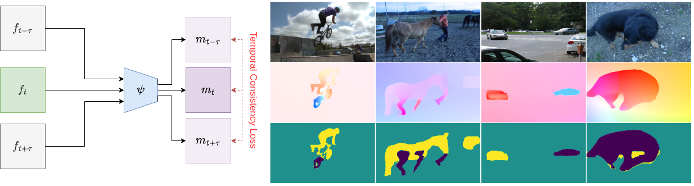
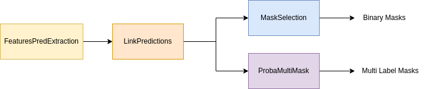

# ST-Space-Time-Flow-segmentation

Short-Time Space Time Flow Segmentation is a code to segment small ( time-wise ) optical flow field volumes and link them together for a long-term coherent segmentation.

[CVPR] : Meunier, Etienne, and Patrick Bouthemy. "Unsupervised Space-Time Network for Temporally-Consistent Segmentation of Multiple Motions." Proceedings of the IEEE/CVF Conference on Computer Vision and Pattern Recognition. 2023.




## CSV Flow Module

In order to use this code with your data you need to create your own "DataSplit" csv files. Those files contain the path to the files used for training / evaluation. Each row represents a sample and columns the file for each modality. You can find more information in this [description](csvflowdatamodule/README.md).

The Datasplit used for training is given as an example as DAVIS_D16Split.

Rows :
Flow : path to an optical flow field (.flo). Can be computed for your dataset using [RAFT] we use raft-sintel.pth.

GtMask: path to the binary mask for evaluation only.

Image : RGB Frame for figures only.

Splits :
Data is split into train, val and test. Train and val are used during in model_train.py, test can be used in model_eval.py.

Those split should follow the name pattern : MySuperSplit_train.csv, MySuperSplit_val.csv and MySuperSplit_test.csv.

## Training


To train the model you can use the

```
python3 model_train.py --path_save_model /path/model_dir\
                       --data_file DataSplit/DAVIS_D16Split\
                       --base_dir /path/dataset/
```

`path_save_model` : path where the model and training progression are saved
`base_dir` : base path for the files in the data split
`data_file`: path of the DataSplits to use
If path_save_model is enabled, the checkpoint (.ckpt) of the best model - defined as the one with the lowest validation loss - is saved along with a file "results.csv" that save score and jaccard for each frame during the training.

All other options have default preset up as the main result in the publication.

**Additional Options :**

- <u>Input Flow</u> :
  - `--image_size int int`  : choose the input  / output size for the frames. Publication : 128x224.
	- `-L int`  : Number of output masks. Publication : 2 for evaluation.
  - `--flow_augmentation str` : use a flow augmentation adding a global motion to the input optical flow as detailed in the paper.  Publication : `globalmotion.QuadraticFullPT.light`.
  - `--experimental_flag [str]` : allows to add experimental changes to the code. In this version only the perturbation of the input flow is implemented. Publication : `PerturbInputFlowNoise`

<u>Model Structure</u> :
  - `--param_model str` : Parametric model to use in the loss. `Quadratic` or `QuadraticFullPT`. Publication : `QuadraticFullPT`


- <u>Training Parameters :</u>
  - All Pytorch Lightning Parameters detailed here : [[link]](https://pytorch-lightning.readthedocs.io/en/latest/common/lightning_module.html)
  - Notably `--gpus int` to enable training with GPU
  - Logger : everything is setup to use a logger. We used [[Wandb]](https://docs.wandb.ai/). See [[PL documentation]](https://pytorch-lightning.readthedocs.io/en/latest/) to setup your own.

## Inference

- For a simple inference process you can check in notebook : [Simple Segmentation Example](Notebooks/Simple Segmentation Example.ipynb)
- For an inference process using csvflowdatamodule you can check the notebook : [Inference](Notebooks/Inference.ipynb)

In order to do inference on a full dataset you can use the scripts in (Inference/FeaturesPredExtraction.py) like that :

```
python3 FeaturesPredExtraction.py --model_dir /path/model_dir\
                       --base_dir /path/dataset/
                       --data_file DataSplit/DAVIS_D16Split\
```
`model_dir` : path where the model is
`base_dir` : base path for the files in the data split
`data_file`: path of the DataSplits to use

This generate the predictions as `.npy` array for all frames and save it in the model_dir given under the path
provided in `Flow`.

You can also use the option `--extract_features` to extract the features of the last layer before classification
in order to use them as motion features for another task. Features are then saves along probabilities with suffix
`_features`.


## Temporal Linking




We describe in detail the evaluation process in the paper. There is several steps :

#### 1. Link predictions together

As explained in Section 3.4 of the paper and Section 1.1 of the appendix, we need to link predictions by subsequence
using the overlap between labels. This is done by the script (Inference/LinkPredictions.py) :

```
python3 LinkPredictions.py --model_dir /path/model_dir\
                       --base_dir /path/dataset/
                       --data_file DataSplit/DAVIS_D16Split\
                       --cut_size 10
```

`--cut_size : int` : is the size of the subsequence (here 10 frames). In the appendix of the paper, we show the impact of this parameter on the results. If you provide None the whole subsequence is treated.

**Output** : `<name_of_sequence>_cs<cut_size>_labelseq.npy` is a (length sequence, t, i, j) label array with labels temporally consistent ( after the linking )

#### 2. Select Masks for Evaluation

##### 2.1 : Mask Selection for Davis16, FBMS and SegTrack :

As described in Section 3.4 of the paper and Section 1.2 of the appendix  for Davis16, FBMS and SegTrack we need to select segments from our output to form a binary segmentation. Note that this part does not modify the masks, just select a set of index for foreground.
In order to go from our 4-segment segmentation to a 2-segment segmentation, we use the provided GtMasks.
This is done in the script :

```
python3 MaskSelection.py --model_dir /path/model_dir\
                       --base_dir /path/dataset/
                       --data_file DataSplit/DAVIS_D16Split\
                       --cut_size 10
```

This selection is also done by subsequences to evaluate the temporal consistency of our segments.

**Output** : binary masks extracted after this step are saved with suffix `_seq_cs<cut_size>binary_eval.npy`

##### 2.2 : Proba to MultiLabel Image for Davis17 :

The mask selection is integrated to the official Davis17 script so we don't need to do the above step. We only change the format of the probability to get a label image for the evaluation.
This is done by the script :

```
python3 ProbaMultiMask.py --model_dir /path/model_dir\
                       --base_dir /path/dataset/
                       --data_file DataSplit/DAVIS_D16Split
```
This scripts takes the labels after the link prediction step, resize them and save them as png file.

**Output** : `<Davis17path>/<cut_size>/image_name.png` label map for each image.

## Evaluation

- For evaluation you can use the scripts in `evaluationmodule`

- Evaluation on Davis 16 is done with the [official script](https://github.com/fperazzi/davis)
- Evaluation on Davis 17 is done with the method and labels given in [OCLR github](https://github.com/Jyxarthur/OCLR_model)


## Computed Results and Model Weight :

You can find results, evaluations and pre-trained weights here :

[[RESULTS](https://gitlab.inria.fr/emeunier/st-space-time-flow-segmentation-data)]

You will also find timing of our method on P100 Gpu with varying input size and number of masks in  `"Timer.pdf"` file.

## Requirements

```
torch==1.13.1
pytorch_lightning==1.8.6
sklearn==1.1.3
flowiz
tqdm
ShapeChecker
```
